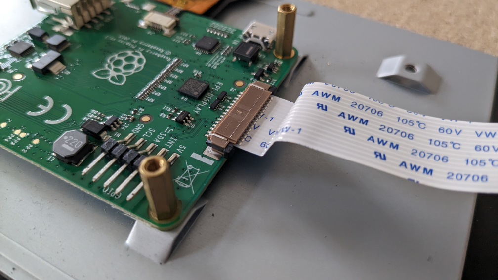
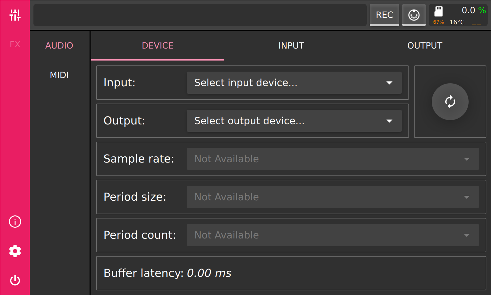
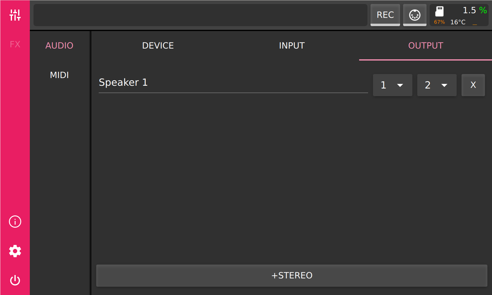
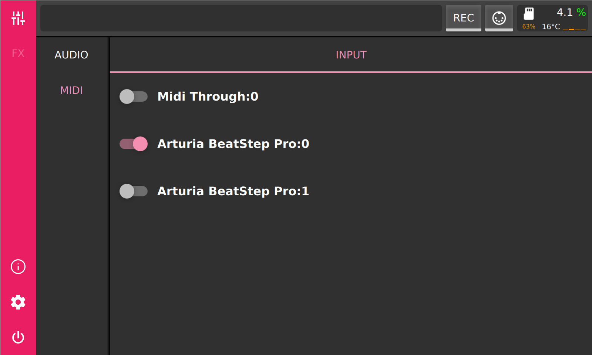
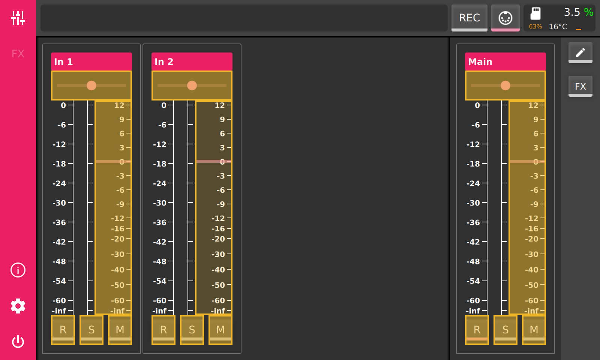
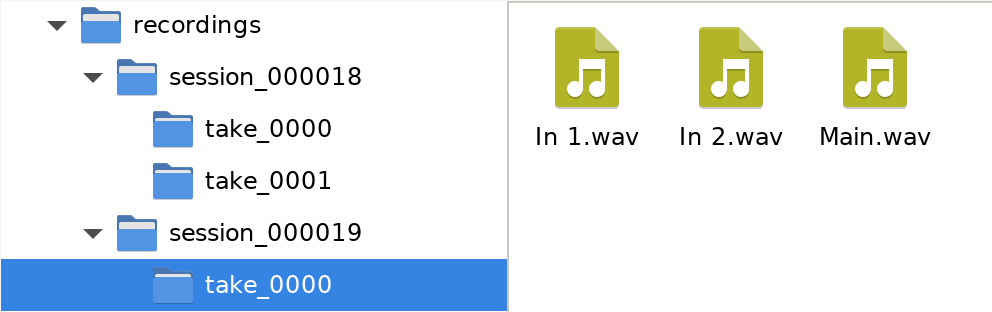
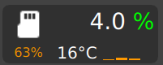

.. PieJam documentation master file, created by
   sphinx-quickstart on Fri Dec 25 11:09:39 2020.
   You can adapt this file completely to your liking, but it should at least
   contain the root `toctree` directive.

PieJam
======

.. toctree::
   :maxdepth: 2
   :caption: Contents:

PieJam is a simple audio mixer for Raspberry Pi. It provides a graphical touch
interface which should be used with the official 7" Raspberry Pi touchscreen.
It needs some external audio interface, most USB based ones should work.

This documentation is work in progress and should give a brief overview of
the functionality.

Features
--------

* Dynamic configuration of inputs and outputs
* Panning, stereo balance and volume controls
* Mute and solo
* Flexible routing between mixer channels
* Fx chain per mixer channel
* Fx modules:

  * Dual Pan
  * Filter
  * Gain
  * Oscilloscope
  * Spectrum Analyzer

* Support for LADSPA plugins
* Parameter control through MIDI CC
* Session recorder

Usage Example
-------------

PieJam is quite flexible and can be used in different scenarios. The main goal
is to mix multiple audio sources. The number of audio sources you can mix depends
usually on the number of inputs your audio interface provides.

Setup & Installation
--------------------

For a minimal setup you will need:

* a Raspberry Pi, supported versions are:

  * 2B v1.1
  * 3B v1.2
  * 4B

* the Raspberry Pi 7" touchscreen display
* a USB audio interface
* SDHC card (at least 512MB) with PieJam OS

Hardware Setup
^^^^^^^^^^^^^^
Connect the ribbon cable to the display:

Connect other end of the ribbon cable to the Raspberry Pi:

Connect the red cable to the 5V pin and the black cable to the GND pin
on the back of the screen.

Connect other end of the red cable to pin 4 and other end of the black
cable to pin 6 on the Raspberry Pi.

Finally connect your USB audio interface to a USB port on Raspberry Pi. The
power supply should be connected to the Raspberry Pi, not the screen! It is
advisable to use the official power supply, because it was designed to properly
deliver enough power for Raspberry Pi, touchscreen and potential
USB devices.

Software Setup
^^^^^^^^^^^^^^
Together with PieJam a tiny Linux system, PieJam OS, was developed. Its' purpose is
to boot as fast as possible and start PieJam. There are prebuilt images
of this system, which you can download here:

https://github.com/nooploop/piejam_os/releases/tag/v0.9.0

Download the image for your version of Raspberry Pi and flash it to a SDHC card.

A beginner friendly way to flash an image, is to use the `Raspberry Pi Imager`_.

   .. _Raspberry Pi Imager: https://www.raspberrypi.com/software/

Tutorial
--------
If PieJam OS was flashed correctly and once the system is powered up, a boot logo
should appear.

On first boot PieJam OS will perform some setup tasks. One of these tasks is to create
a data partition. Depending on the size and speed of the SDHC card in use, this task may take
several seconds to several minutes.

.. image:: images/boot_setup.png
   :align: center

When the boot process is finished, the application starts and you will be presented with main mixer view.
On the left is the main toolbar, where you can switch between main views: mixer, fx, logger, settings and power.
On top is the statusbar, containing a field for messages and tooltips, a session record button, a midi learn button and
a system info field. On the right is a toolbar for the selected view. In the middle you'll see the mixer in its initial state,
containing only the main mixer channel.

Audio Device Configuration
^^^^^^^^^^^^^^^^^^^^^^^^^^
As next step we need to configure the audio device. Most USB audio devices should work. Therefore make sure the audio device is
connected to the Raspberry Pi and select the settings button (cog icon) on the main toolbar.

As first an input and an output device should be selected. It's possible to select different physical devices for input and output,
but best results are achieved if same device is used for input and output. If the device is not listed in the selection box,
try refreshing the list by pressing the refresh button to the right of the selection boxes. As next you should select a sample rate,
period size and period count. For best results with USB audio devices set the sample rate to 48000 or 96000 Hz and period count to 3.
By controlling the period size, you can influence the latency. Lower period size means lower latency. You
can further reduce latency by increasing the sample rate or by reducing the period count, but work with period size first.
Lower latency means always higher CPU usage, higher CPU usage could lead to audio glitches and dropouts. Therefore you should strive
to find the best balance for your usecase. Try to reduce the latency for better live performance, but keep an eye on the CPU usage to
avoid audio dropouts.

.. image:: images/audio_device_settings.png
   :align: center

As next we need to configure the physical inputs and outputs. Therefore select the input or the output tab to perform the configuration.
On the input tab, press '+MONO' to add a mono device bus or '+STEREO' to add a stereo device bus.

.. image:: images/audio_input_settings.png
   :align: center

Output device buses are always stereo. By changing the channel assignment you can route the device bus to different physical inputs/outputs.

Mixer
^^^^^
After audio device configuration, we need to configure the mixer channels. First switch to mixer by pressing the mixer button on the main toolbar.
The view which shows level meters and faders is called the 'performance' view of the mixer. To configure the mixer channels we need to
switch into the 'edit' view of the mixer. The 'edit' view can be switched to by pressing the 'pencil' button on the view toolbar, which is to the
right of the mixer.

.. image:: images/mixer_edit_view_initial.png
   :align: center

The 'edit' view allows you to add and remove channels and to configure those. The 'main' channel is always present and cannot be removed.
There are two kind of channels which can be created a 'mono' and a 'stereo' one. A mono channel should be used when a mono device input is used,
otherwise a stereo channel should be used. The 'main' channel is a stereo one. The field at the top of every channel can be used to rename it.
Below are two fields for input and output routing of a channel. Mono channel input can only be assigned to a device input or stay unassigned.
Mono channel output can be routed to another stereo channel, a device output or stay unassigned. Stereo input can be set to receive its'
signal from another channel, a stereo device input or the 'mix' input. The 'mix' input is the sum of all channels which route their output
to this channel. The output of a stereo channel can be routed to a device output, to another stereo channel or stay unassigned.

Switching back to 'performance' view is done by pressing the 'pencil' button on the view toolbar or by pressing the 'mixer' button on the
main toolbar. On top of each channel there is a field with its name, which can be changed on the 'edit' view. Beneath is a bipolar slider,
which controls the panning on a mono channel or the stereo balance on a stereo channel. Below are the level meters and the volume fader.
The level meters show the output level after the volume fader is applied. At the bottom there are three control buttons. 'R' toggles
the record state during session recording. 'S' (Solo) will mute all other channels in same mixing group, which are not soloed too. Channels
belong to same mixing group if they have same output destination. 'M' will mute the channel.

.. image:: images/mixer_performance_view.png
   :align: center

Every channel allows modification of the audio signal by audio effects. Those can be inserted when the mixer is switched to 'effects' view.
Switching to 'effects' view is done by pressing the 'FX' button on view toolbar, to the right of the mixer.

Appending an effect to a channels effect chain is done by pressing the '+' button at the bottom of the corresponding channel. When the '+'
button is pressed the effect browser will appear.

To the left is a list of available effect modules. The list may differ depending on the configuration of the channel (mono/stereo). After
selecting an effect in the list, by pressing 'INSERT' button, the module will be appended to the effect chain of the corresponding channel.
When the module is inserted, the view will switch to the newly inserted module. To add more modules switch to the mixer by pressing the
'mixer' button on the main toolbar. Perform the same series of actions to add more modules. By pressing on a name of an effect module in the
'fx' view, the module will selected. Selection is indicated by a highlighted border and a delete button ('X') will appear to the right of the name
of the selected module. The position of a selected module inside the effect chain can be changed with the up and down buttons at the bottom
of the channel with selected module. Moving a module up will move it closer to the input and moving it down will move it closer to the output.

Clicking on the selected module again will show the modules interface and switch into 'FX' view. When there is a selected module the 'FX' button
on the main toolbar will be active and by pressing it, it will always show the last selected effect module.

MIDI
^^^^
MIDI continuous controller messages can be used to control parameters in PieJam. Most mixer parameters and almost all parameters of any effect module
can be controlled. To be able to assign MIDI CC to a parameter, a MIDI sending device should be enabled first. All available MIDI devices will be listed
on the 'MIDI' settings tab. There, every MIDI sending device can be switched on and off.

After a MIDI device was enabled, we can assign a MIDI CC to a parameter. For this we need to switch into MIDI assign mode, by pressing the 'MIDI'
button in the status bar at the top. Every assignable parameter will get a yellow overlay. Pressing on one of those overlays will activate it and it
starts to flash. This signals that this parameter is now in 'learning' mode and is waiting for any incoming MIDI CC messages.

When a MIDI CC message is received, the 'learning' parameter will be immediately assigned to this CC and can now be controlled by it. Every following
MIDI CC message with the assigned CC number will modify this parameter with the corresponding CC value. The overlay of an assigned parameter will
become green. The assigned CC is noted in the left-top corner of the overlay, e.g. 'CC 10 @1', which means 'CC 10' on MIDI channel 1. Pressing the
'MIDI' button in statusbar at the top again, will leave the MIDI-assign mode.

Session Recording
^^^^^^^^^^^^^^^^^
PieJam provides a simple way to record the output of every mixer channel. To mark a mixer channel for recording, toggle the 'R' button on the
corresponding channel. To start recording press the 'REC' button on the statusbar at the top. To stop recording press the 'REC' button again.
PieJam will record the output to files stored in the data partition on the microSD card. Files will be stored in a specific folder structure.
The top folder is called 'recordings'. Beneath you will find the session folders. The folders are enumerated in increasing order. Everytime PieJam
starts a new session folder will be created when recording starts. Further down there are 'take' folders. Those are created everytime the
'REC' button is toggled. So a session might consist of multiple takes. Every channel which is marked for recording will record into a file inside
of a 'take' folder.

Info Field
^^^^^^^^^^
The field in the top right corner contains some information about the status of the system. The percentage underneath the microSD icon indicates how
much space of the data partition is used. The celsius readout is the temperature of the CPU. And atlast the percentage shows audio load. Higher load
may lead to dropouts. The color of the percentage sign indicates the occurence of dropouts. Green means that there were no dropouts sofar. Red means
that a dropout occured recently. And yellow means that a dropout occured some time ago (more than 2 sec). Below the percentage, four small bars show
the load of every CPU core on the Raspberry Pi.

