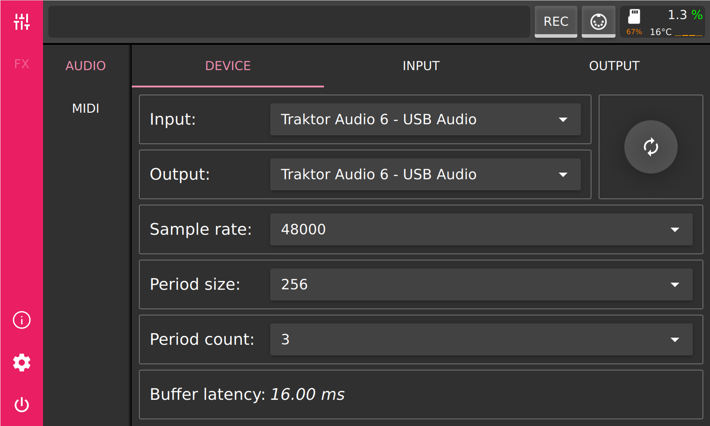
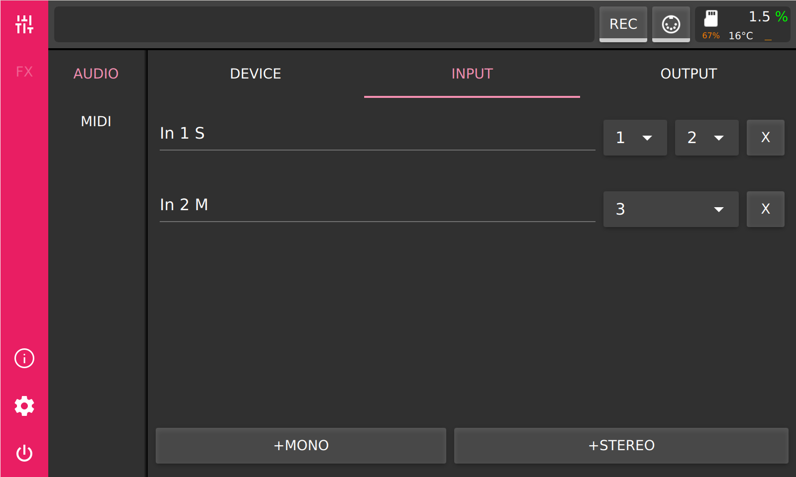

.. PieJam documentation master file, created by
   sphinx-quickstart on Fri Dec 25 11:09:39 2020.
   You can adapt this file completely to your liking, but it should at least
   contain the root `toctree` directive.

Welcome to PieJam's documentation!
==================================

.. toctree::
   :maxdepth: 2
   :caption: Contents:

PieJam is a simple audio mixer for Raspberry Pi. It provides a graphical touch
interface which should be used with the official 7" Raspberry Pi touchscreen.
It needs some external audio interface, most USB based ones should work.

This documentation is work in progress and should give a brief overview of 
the functionality.

Features
--------

* Dynamic configuration of inputs and outputs
* Panning, stereo balance and volume controls
* Mute and solo
* Fx chain per mixer bus
* Support for LADSPA plugins

User interface
--------------

Audio device settings

Audio input settings

Audio output settings

.. image:: images/audio_output_settings.png
   :align: center

Mixer

.. image:: images/mixer.png
   :align: center

Fx chain

.. image:: images/fx_chain.png
   :align: center

Fx browser

.. image:: images/fx_browser.png
   :align: center