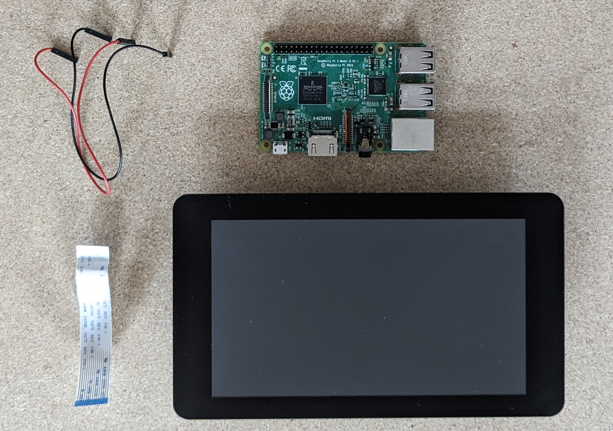
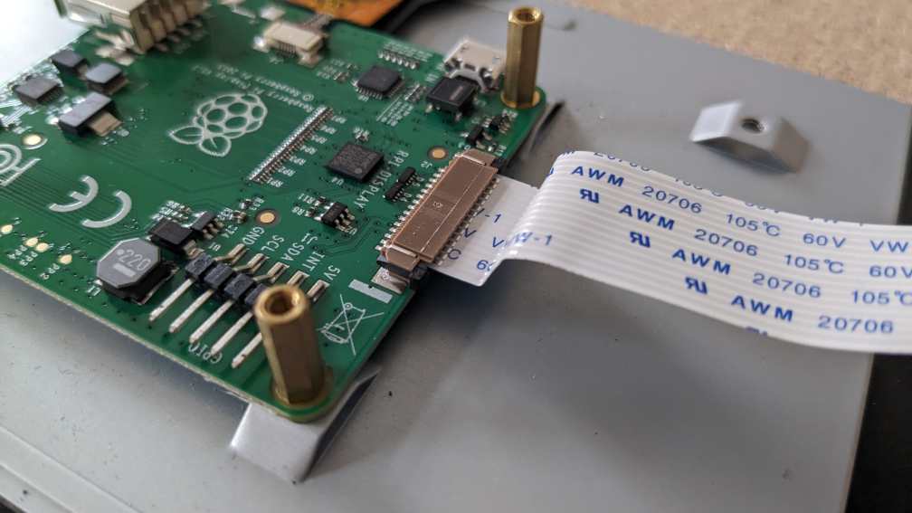
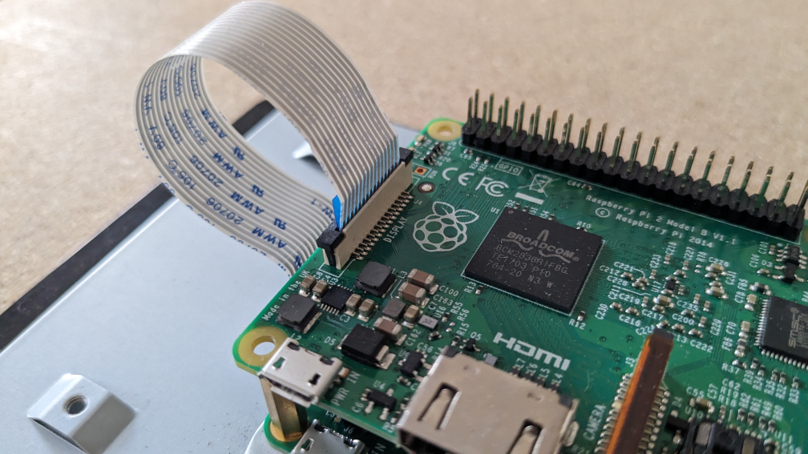
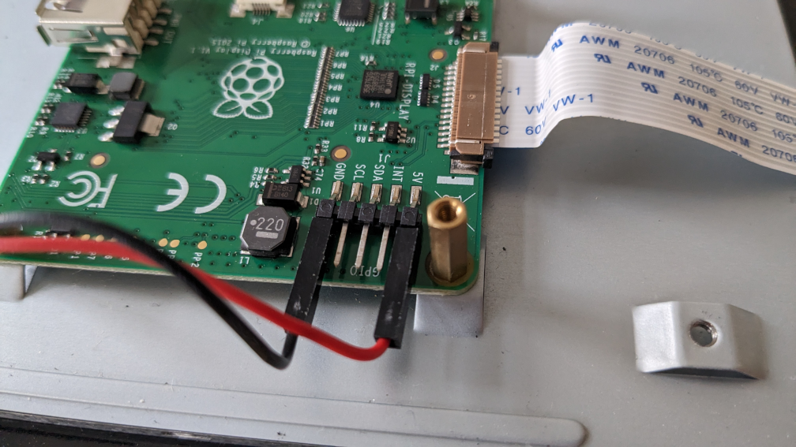
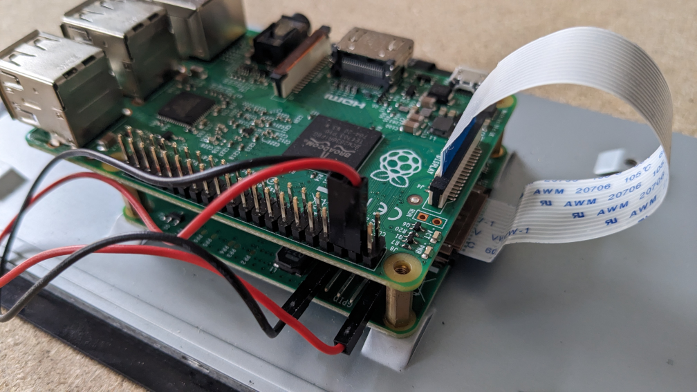

Setup & Installation
====================

For a minimal setup you will need:

* a Raspberry Pi, supported versions are:

  * 2B v1.1
  * 3B v1.2
  * 4B
  * 5B

* the Raspberry Pi 7" touchscreen display (V2 is only supported on 4B or 5B)
* a USB audio interface
* SDHC card (at least 512MB) with PieJam OS

Hardware Setup
--------------

Connect the ribbon cable to the display:

Connect other end of the ribbon cable to the Raspberry Pi:

Connect the red cable to the 5V pin and the black cable to the GND pin
on the back of the screen.

Connect other end of the red cable to pin 4 and other end of the black
cable to pin 6 on the Raspberry Pi.

Finally connect your USB audio interface to a USB port on Raspberry Pi. The
power supply should be connected to the Raspberry Pi, not the screen! It is
advisable to use the official power supply, because it was designed to properly
deliver enough power for Raspberry Pi, touchscreen and potential
USB devices.

Software Setup
--------------

Together with PieJam a tiny Linux system, PieJam OS, was developed. Its' purpose is
to boot as fast as possible and start PieJam. There are prebuilt images
of this system, which you can download here:

https://github.com/nooploop/piejam_os/releases/tag/v0.12.0

Download the image for your version of Raspberry Pi and flash it to a SDHC card.

A beginner friendly way to flash an image, is to use the `Raspberry Pi Imager`_.

   .. _Raspberry Pi Imager: https://www.raspberrypi.com/software/
