Tutorial
========

If PieJam OS was flashed correctly, a boot logo should appear when the system is powered on.

On first boot, PieJam OS performs several initialization tasks, including creation of a data partition.
Depending on the size and performance of the SDHC card, this process may take from several seconds to several minutes.

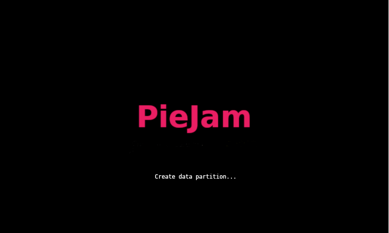

When the boot process is complete, the application starts and the main mixer view is displayed.

On the left is the main toolbar, which allows you to switch between the primary views: **Mixer**, **FX**, **Logger**, **Settings**, and **Power**.

At the top is the status bar, which contains a message and tooltip field, a session record button, a MIDI learn button, and a system information field.

On the right is a context toolbar for the currently selected view.

In the center is the mixer in its initial state, containing only the main mixer channel.

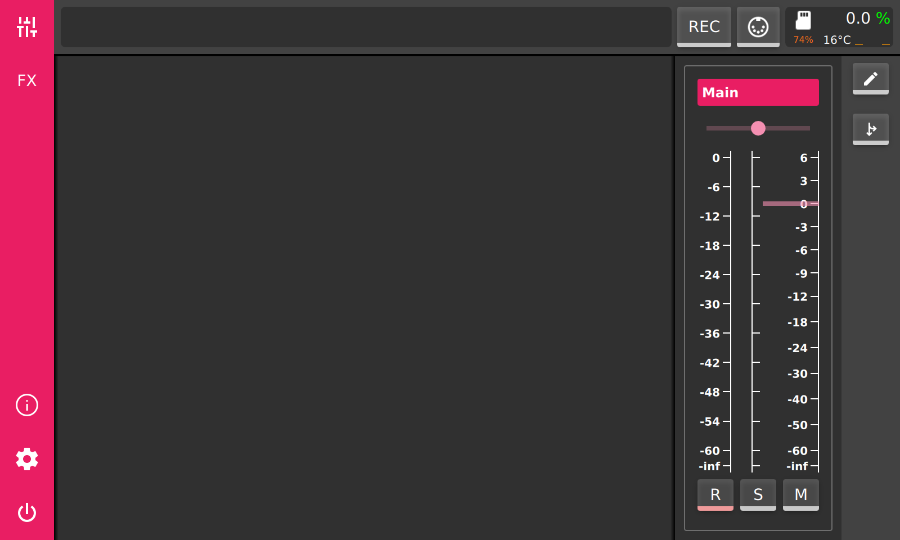

Audio Device Configuration
--------------------------

Next, configure the audio device. Most USB audio devices are supported.
Ensure that the audio device is connected to the Raspberry Pi, then select
the **Settings** button (cog icon) in the main toolbar.

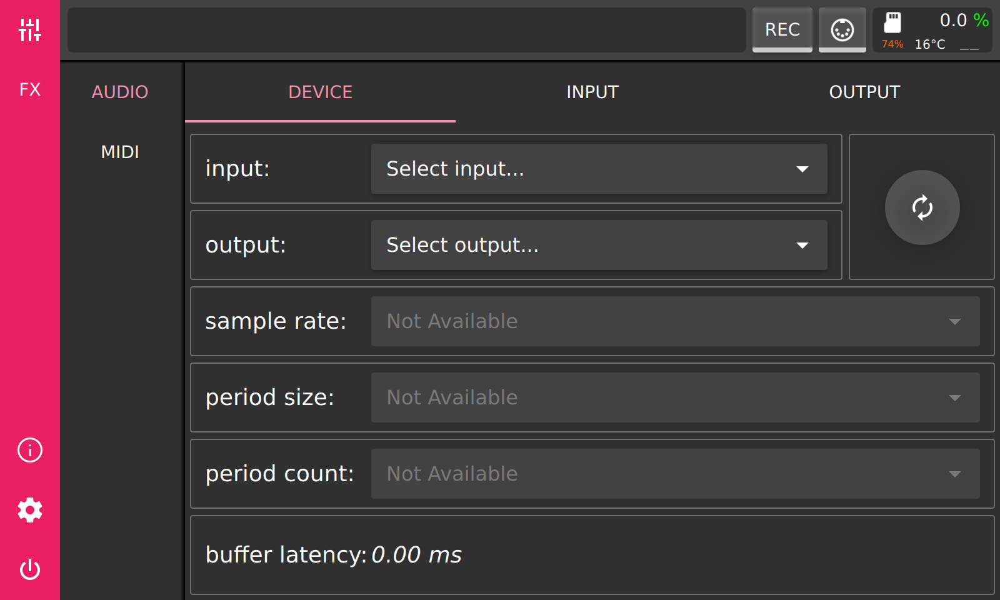

First, select the audio device. Next, choose a sample rate and buffer size.

For best results with USB audio devices, set the sample rate to **48000 Hz** or **96000 Hz**,
and choose a buffer size whose duration is a multiple of **1 ms**.

The buffer size directly affects latency: smaller buffers reduce latency, but increase CPU load.
Higher CPU load can cause audio glitches and dropouts.

You should aim to find an appropriate balance for your use case.
For live performance, reduce latency as much as possible while monitoring CPU usage to avoid audio dropouts.

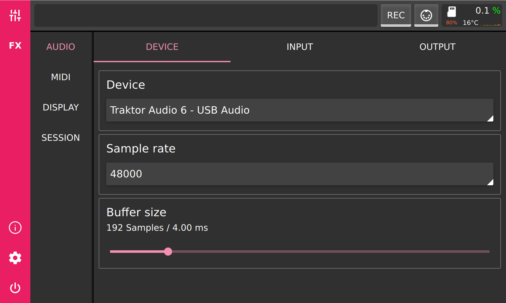

Next, configure the physical inputs and outputs. Select the **Input** or **Output** tab to perform the configuration.

On the **Input** tab, press **+MONO** to add a mono device bus, or **+STEREO** to add a stereo device bus.

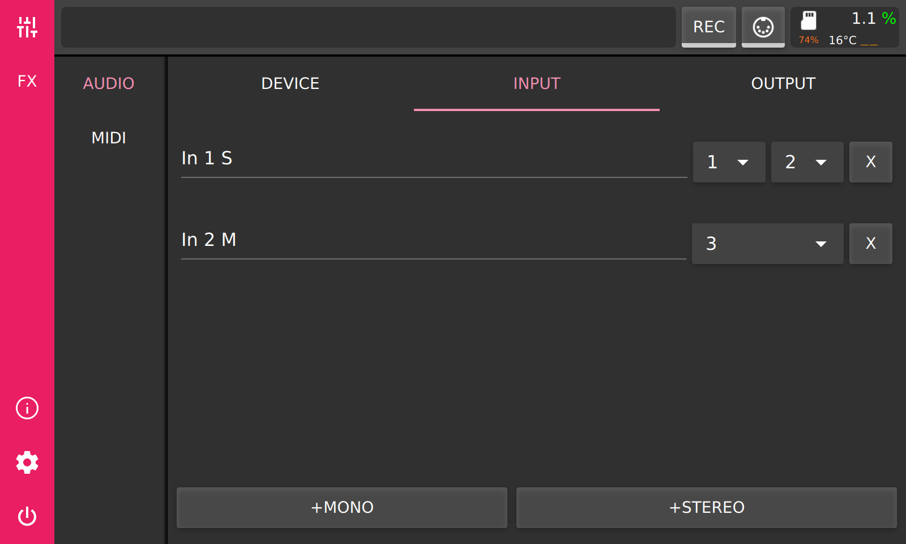

Output device buses are always stereo. By changing the channel assignment,
you can route a device bus to different physical inputs or outputs.

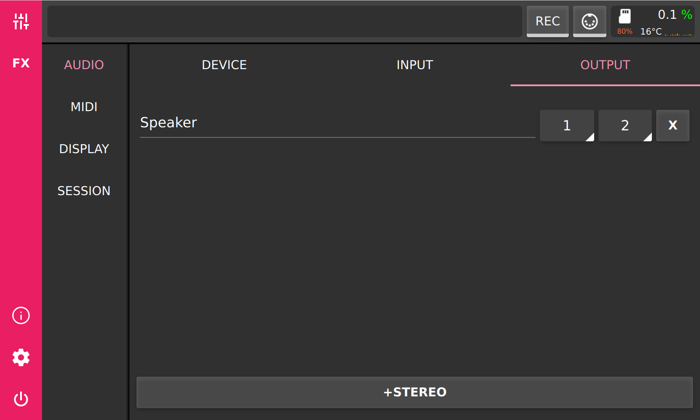

Mixer
-----

After configuring the audio device, configure the mixer channels.
First, switch to the **Mixer** view by pressing the **Mixer** button in the main toolbar.

The view that displays level meters and faders is the mixer **Performance** view.
To configure mixer channels, switch to the **Edit** view.

You can switch to the **Edit** view by pressing the **Pencil** button in the context view toolbar on the right side of the mixer.

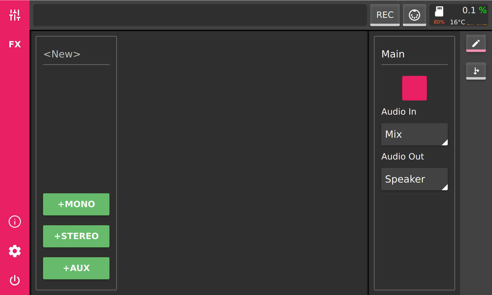

The **Edit** view allows you to add, remove, and configure mixer channels. The **Main** channel is always present and cannot be removed.

Three channel types can be created: **Mono**, **Stereo**, and **Aux**.

* Use a **Mono** channel for mono device inputs.
* Use a **Stereo** channel for stereo device inputs.
* The **Main** channel is a stereo channel.

The field at the top of each channel is used to rename the channel.
Below it is the color selector, which assigns a display color to the channel.

Below are the input and output routing fields for the channel:

**Mono channels**

* Input: can be assigned to a device input or left unassigned.
* Output: can be routed to a stereo channel, a device output, or left unassigned.

**Stereo channels**

* Input: can receive its signal from another channel, a stereo device input, the Mix input, or be left unassigned.
* The **Mix** input is the sum of all channels that route their output to this channel.
* Output: can be routed to a device output, another stereo channel, or left unassigned.

**Aux channels**

Aux channels are typically used for effects sends or cue mixes.

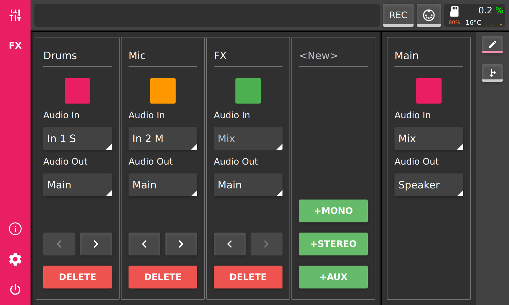

You can switch back to the **Performance** view by pressing the **Pencil** button in the view toolbar or the **Mixer** button in the main toolbar.

At the top of each channel is its name field, which can be edited in the **Edit** view.
Beneath it is a bipolar slider that controls *panning* for mono channels and *stereo balance* for stereo channels.

Below the slider are the level meters and the volume fader. The level meters display the channel output level after the volume fader is applied.

At the bottom of each channel are three control buttons:

* **R**: Toggles the record state for session recording.
* **S** (Solo): Mutes all other channels in the same mixing group that are not soloed. Channels belong to the same mixing group if they share the same output destination.
* **M** (Mute): Mutes the channel.

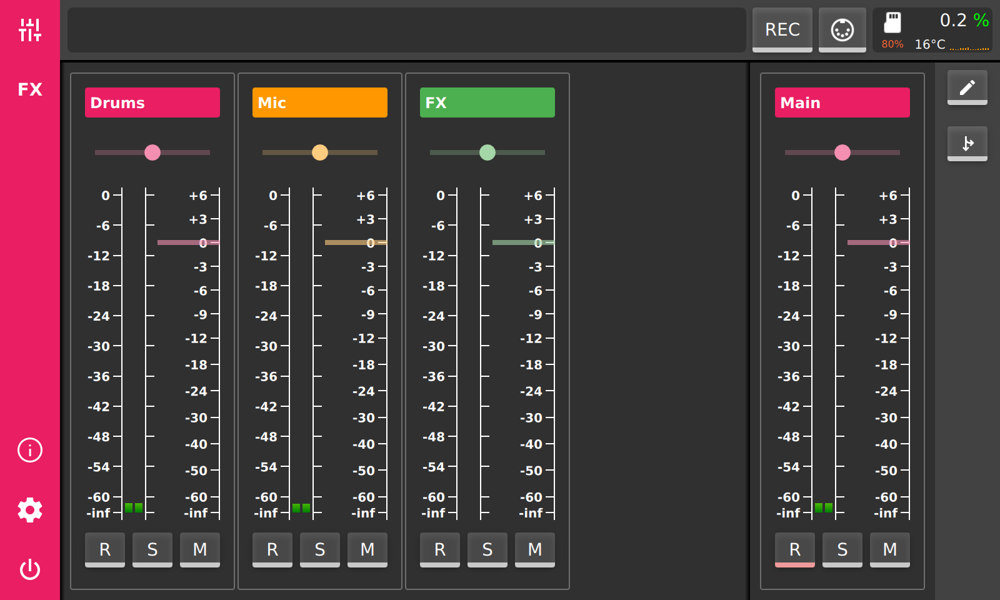

Click the **Arrows** button below the **Pencil** button to switch to the **Aux Sends** view.

In this view, you can send a portion of each channel’s signal to an **Aux** channel.
You can also choose whether the signal is tapped *pre-* or *post-fader*.

By default, this setting is **Auto**, which follows the default fader tap configured on the corresponding **Aux** channel.

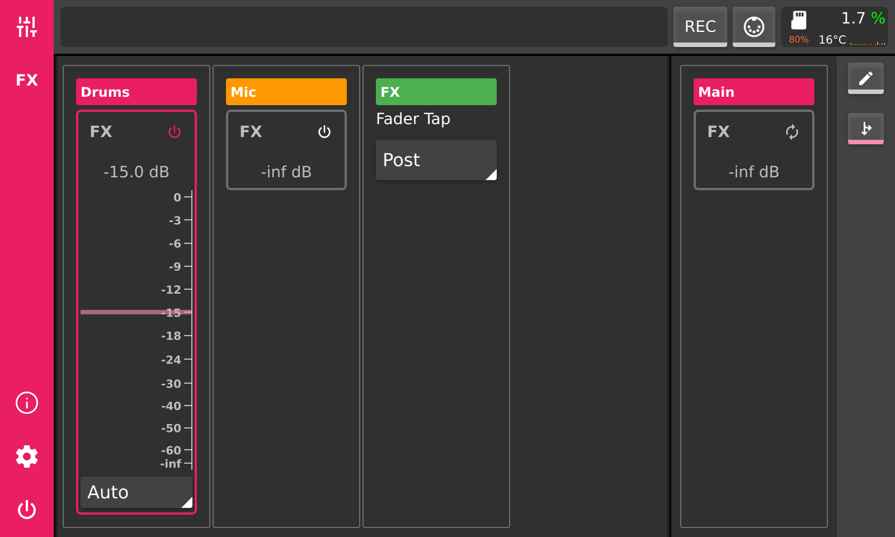

Effects
-------

Every channel allows modification of its audio signal using audio effects. Effects can be inserted when the mixer is in the **Effects** view.

To switch to the **Effects** view, press the **FX** button in the main toolbar, located to the left of the mixer.

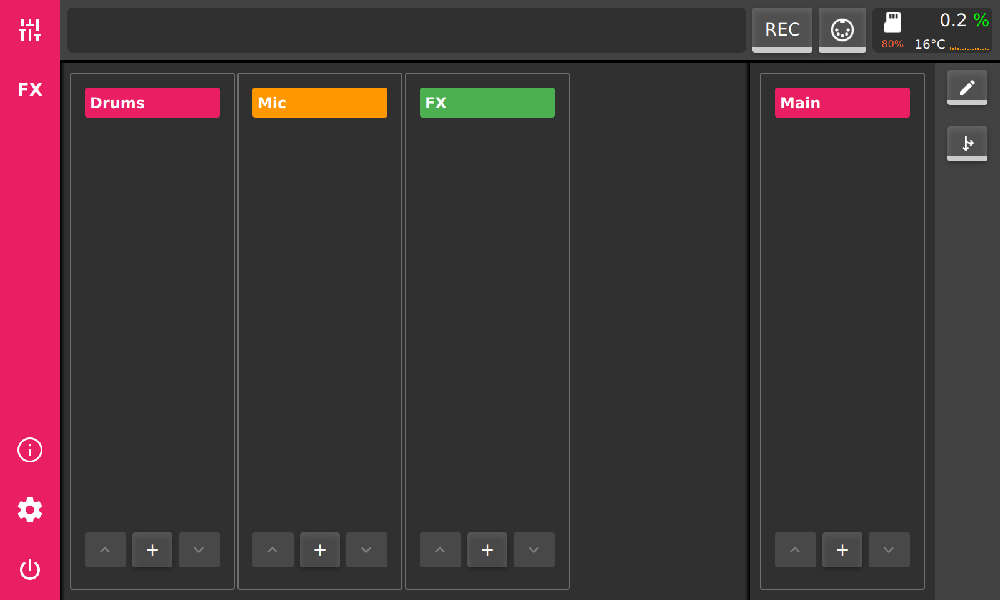

To append an effect to a channel’s effect chain, press the **+** button at the bottom of the corresponding channel.

Pressing the **+** button opens the **Effect Browser**.

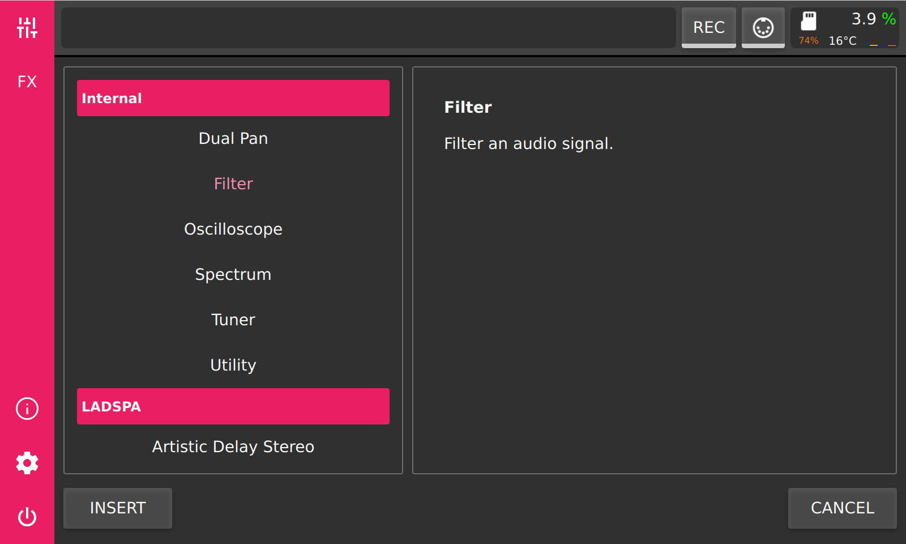

On the left is a list of available effect modules. The list may vary depending on the channel type (Mono or Stereo).

To add an effect, select it from the list and press the *INSERT* button.
The module will be appended to the effect chain of the corresponding channel.
After insertion, the view will switch to the newly added module.

To add additional modules, return to the **Effects** view by pressing the **FX** button and repeat the same steps.

In the **Effects** view, clicking on the name of an effect module selects it.
Selection is indicated by a highlighted border, and a **Delete (X)** button appears to the right of the module name.

The position of a selected module within the effect chain can be changed using the **Up** and **Down**
buttons at the bottom of the channel. Moving a module *up* positions it closer to the input,
while moving it *down* positions it closer to the output.

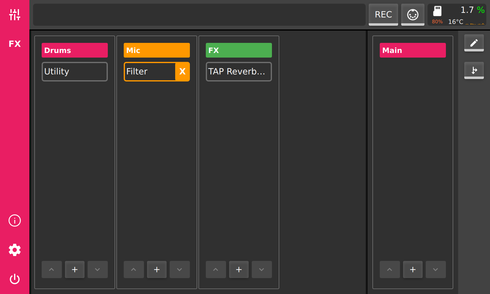

Clicking on a selected module again opens the module’s interface.

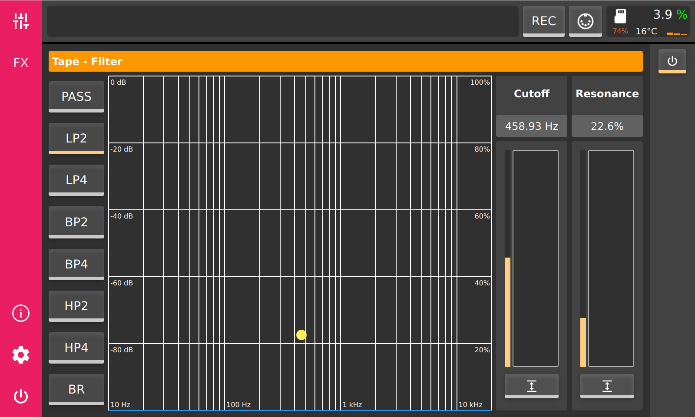

MIDI
----

MIDI CC and pitch bend messages can be used to control parameters in PieJam.
Most mixer parameters and nearly all parameters of any effect module are controllable.

To assign a MIDI CC or pitch bend to a parameter, a MIDI input device must be enabled first.

All available MIDI devices are listed on the **MIDI** settings tab.
Each MIDI input device can be individually enabled or disabled there.

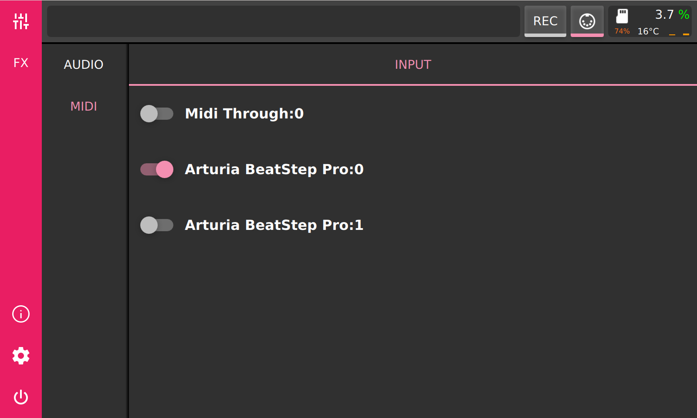

After enabling a MIDI device, you can assign a MIDI CC to a parameter.

First, switch to **MIDI Assign** mode by pressing the *MIDI* icon button in the status bar at the top.
All assignable parameters will be highlighted with a *yellow* overlay.

Clicking on a highlighted parameter activates it, causing it to flash.
This indicates that the parameter is now in *learning* mode and is waiting for incoming MIDI CC messages.

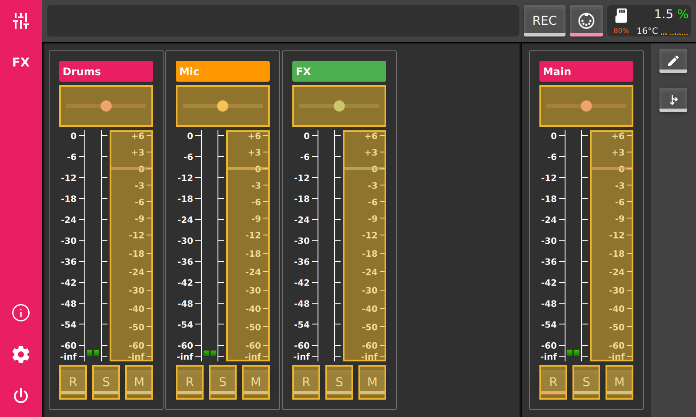

When a MIDI CC message is received, the parameter in *learning* mode is immediately assigned
to that CC and can now be controlled by it. Any subsequent MIDI CC messages with the same CC
number will adjust the parameter according to the received CC value.

The overlay of an assigned parameter turns *green*. The assigned CC is displayed in the top-left corner of the overlay,
for example, [CC 10 @1], which means *CC 10* on MIDI channel 1.

Pressing the MIDI icon button in the status bar again exits **MIDI Assign** mode.

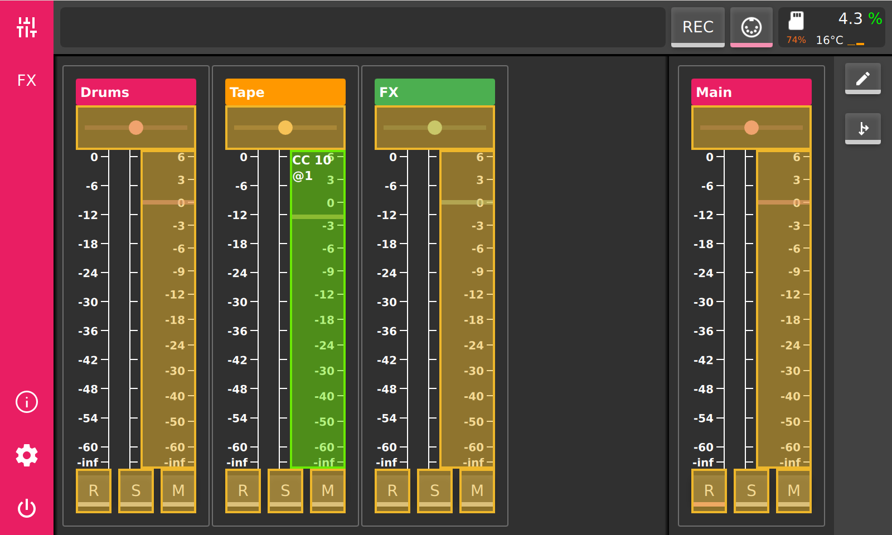

Session Recording
-----------------

PieJam provides a simple way to record the output of each mixer channel. To mark a channel for recording, toggle the *R* button on that channel.

To start recording, press the *REC* button in the status bar at the top. Press the *REC* button again to stop recording.

PieJam saves the recorded output as files on the data partition of the microSD card, using a structured folder hierarchy:

* The top-level folder is called *recordings*.
* Inside it are *session* folders, numbered sequentially. A new *session* folder is created each time recording begins in a new session.
* Within each *session* folder are *take* folders, created each time the *REC* button is toggled. A session may therefore contain multiple takes.
* Each channel marked for recording creates a file inside the corresponding take folder.

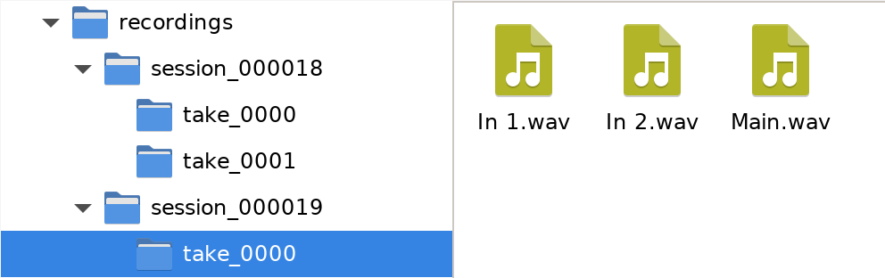

Info Field
----------

The field in the top-right corner displays information about the system status.

* The percentage below the microSD icon indicates the used space on the data partition.
* The temperature readout shows the CPU temperature in Celsius.
* The percentage labeled Audio Load shows the current audio processing load. Higher load may cause audio dropouts.
* The color of the audio load percentage indicates dropout occurrences: *Green* means no dropouts have occurred, *Red* indicates a recent dropout, and *Yellow* indicates a dropout occurred more than 2 seconds ago.
* Below the audio load percentage, four small bars display the load of each CPU core on the Raspberry Pi.

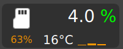

Settings
--------

Display
*******

On the **Display** settings tab, you can set the screen rotation.
This is especially useful for the V2 touchscreen, which defaults to portrait mode.

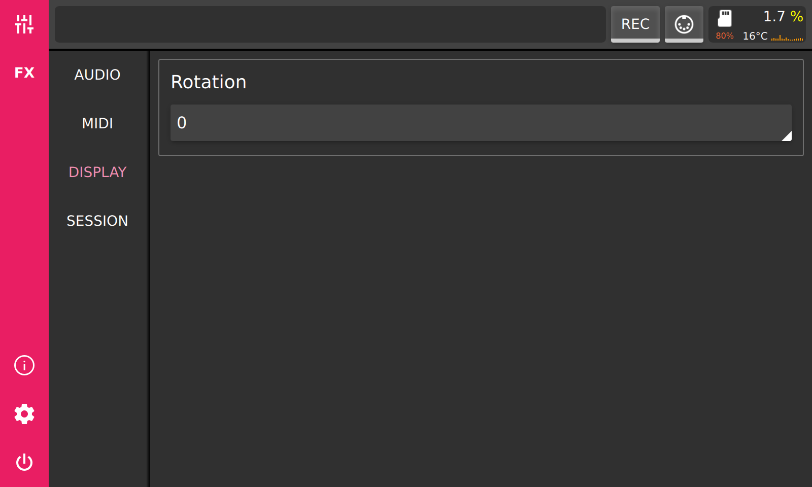

Session
*******

The *Session* settings tab contains all session-related options and actions.

Available actions include:

* *Create a new session* – Start a fresh session with default settings.
* *Set a template for new sessions* – Choose a session template that will be used as the starting point for new sessions.
* *Save the current session* – Save all current mixer settings, channels, and configurations.
* *Load a previously saved session* – Open a session that was saved earlier.
* *Set the default startup session* – Specify which session is loaded automatically when PieJam starts; this can be a new session or the current session.

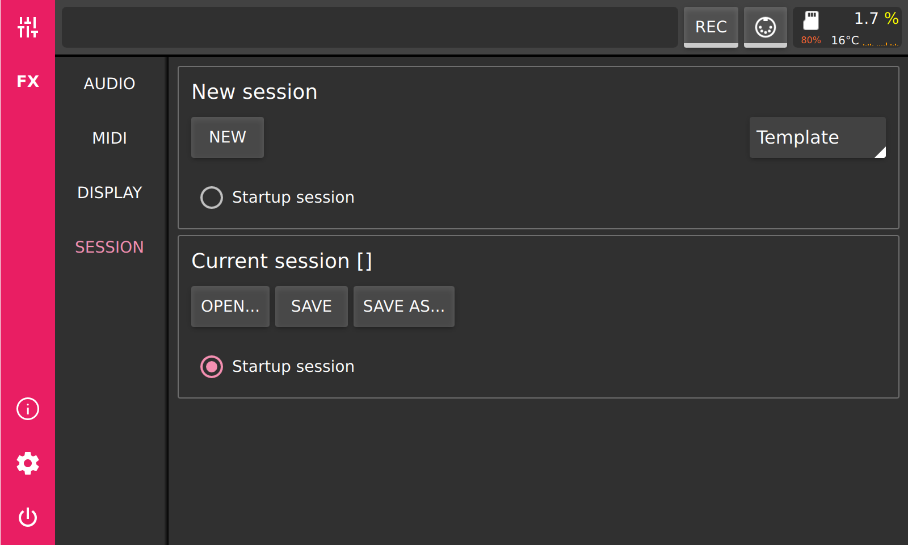